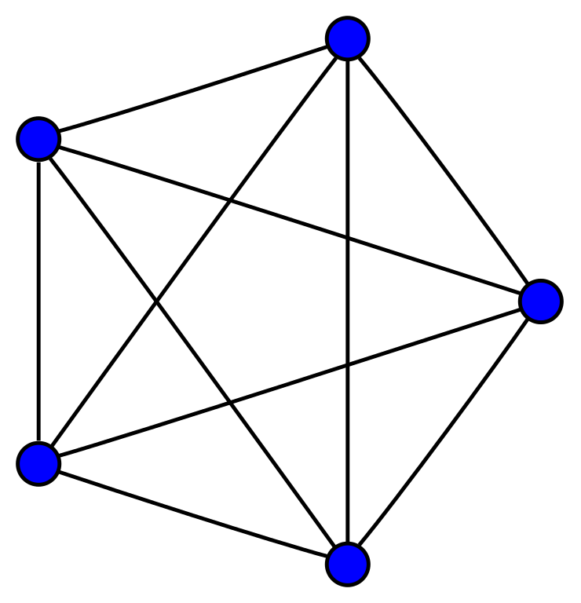
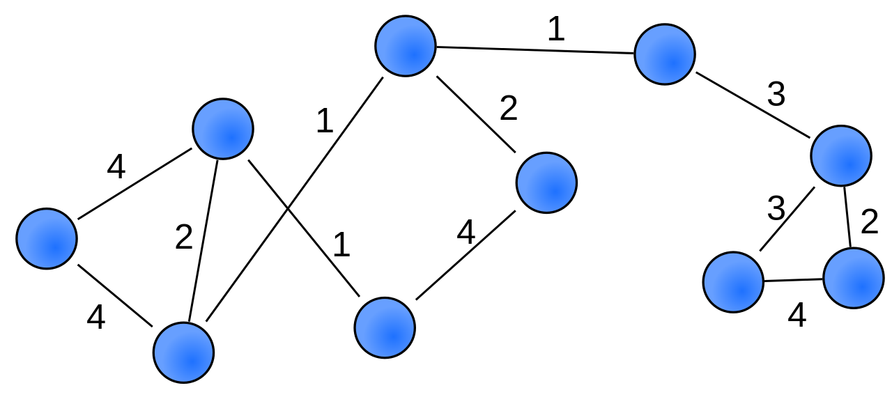
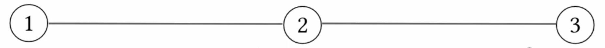

# Introduction

## General Equilibrium Theory

- Long history and deep mathematical grounding
- We attempt to explain supply, demand, and prices
- Arrow--Debreu Model is **central**

# Setting and Background

---

We consider economies consisting of:

- A set $[\ell] := \{1, \dots, \ell\}$ of **divisible goods**
- A set $[m] := \{1, \dots, m\}$ of **agents embedded as nodes** in some graph $G = ([m], E)$, whose edges $E$ describe who may trade with whom
- A **bundle of goods** $\mathbf{e}^i \in \R^\ell_+$ that agent $i \in [m]$ enters the market with
- A **utility function** $u_i : \R^\ell_+ \to \R_+$ that encodes agent $i$'s preferences over bundles of goods

---

### Graphical Economy
A **graphical economy** is an undirected graph $G$ over agents $[m]$ with neighbor relation $\simeq$, utilities $\{u_i : \R^\ell_+ \to \R_+\}_{i \in [m]}$, and endowments $\{\mathbf{e}^i \in \R^\ell_+\}_{i \in [m]}$, where $\ell$ is an integer denoting the number of goods being traded.

---

For ease of exposition, $G$ is assumed undirected --- all results can be easily extended to directed graphs.

---

To discuss equilibria in a graphical economy, we also need:

- Local price vectors $\mathbf{p}^i \in \R^\ell_+$ for each agent $i \in [m]$
- The bundle of goods $\mathbf{x}^{ij} \in \R^\ell_+$ agent $i$ purchases from agent $j$ for consumption
  - To enforce the condition that trade must traverse edges, $\mathbf{x}^{ij} = 0$ for $j \not\simeq i$

---

Agent $i$ buys an amount $x^{ij}_k$ of good $k$ from agent $j$ for consumption

\begin{gather*}
i \neq j \in [m] \\
k \in [\ell]
\end{gather*}

# The Arrow--Debreu (AD) Exchange Model

---

The graphical economies are generalizations of AD which retain AD as a special case.

---

### AD Equilibrium

An **AD Equilibrium** is a pair $(\mathbf{p}, \mathbf{x})$ of a set of price vectors $\mathbf{p}$ and set of consumption plans $\mathbf{x}$ such that, if the underlying graph is complete, we have $\mathbf{p}^i = \mathbf{p}^j$ for all $i, j \in [m]$, and the following conditions are satisfied:

- *Market Clearing.*

$$
\sum_{i,j \in [m]} \mathbf{x}^{ij} = \sum_{i \in [m]} \mathbf{e}^i
$$

- *Individual Rationality.* For all agents $i \in [m]$, setting $\hat{\mathbf{x}}^i = \mathbf{x}^i$ maximizes their utility $u_i \left( \sum_{j \simeq i} \hat{\mathbf{x}}^{ij} \right)$ over all $\hat{\mathbf{x}}^i \in \R^\ell_+$ satisfying

$$
\sum_{j \simeq i} \mathbf{p}^j \cdot \hat{\mathbf{x}}^{ij} \leq \mathbf{p}^i \cdot \mathbf{e}^i
$$

---

- Agents sell endowments at market prices
- They spend profits on goods maximizing their utility
- There is a single global market
  - Single price for each good
  - Every pair of agents can trade
  - Markets are cleared when the demand of all agents is equal to the supply of all agents

---

\centering
{width=30%}

> We would like something more **local**

\centering
{width=60%}

# The Kakade, Kearns, Ortiz (KKO) Exchange Model

---

### KKO Equilibrium

An **KKO Equilibrium** is a pair $(\mathbf{p}, \mathbf{x})$ of prices $\mathbf{p} \in \R^{m \times \ell}$ and consumption plans $\mathbf{x} \in \R^{m \times m \times \ell}$ such that the following conditions are satisfied for all $i \in [m]$:

- *Local Clearing.*

$$
\sum_{j \simeq i} \mathbf{x}^{ji} = \mathbf{e}^i
$$

- *Individual Rationality.* Setting $\hat{\mathbf{x}}^i = \mathbf{x}^i$ maximizes their utility $u_i \left( \sum_{j \simeq i} \hat{\mathbf{x}}^{ij} \right)$ over all $\hat{\mathbf{x}}^i \in \R^{m \times \ell}_+$ satisfying

$$
\sum_{j \simeq i} \mathbf{p}^j \cdot \hat{\mathbf{x}}^{ij} \leq \mathbf{p}^i \cdot \mathbf{e}^i
$$

---

- Network of local markets
  - Each agent sets its own price for each good
  - Pairs of agents can trade if connected by an edge
  - Markets are cleared when the demand of each agent is equal to the supply of each agent
- Captures underlying trade structures of economies
- Can be too local in some cases

## Local prices

\centering
{width=70%}

\begin{align*}
\mathbf{e}^1 = (1, 2) && \mathbf{e}^2 = (1, 1) && \mathbf{e}^3 = (2, 1) \\
\mathbf{u}^1 = (1, 0) && \mathbf{u}^2 = (1, 1) && \mathbf{u}^3 = (0, 1) \\
\mathbf{p}^1 = (2, 1) && \mathbf{p}^2 = (2, 2) && \mathbf{p}^3 = (1, 2)
\end{align*}

> There is **no** graphical equilibrium in which the prices for both goods is the same from all consumers, so price variations are essential for equilibrium

# Graphical Equilibrium Existence

---

### Assumptions

**A-1.** For all consumers $i$, the utility function $u_i$ satisfies the following three properties:

- continuity
- strict monotonicity
- quasi-concavity

**A-2.** (Non-Zero Endowments) For each consumer $i$ and good $k$, $e^i_k > 0$

---

### Graphical Quasi-Equilibrium

An **graphical quasi-equilibrium** is a set of globally normalized prices (i.e., $\sum_{i, k} p^{ik} = 1$) and a set of consumption plans in which the local markets clear for each consumer $i$, with wealth $\mathbf{w}^i = \mathbf{p}^i \cdot \mathbf{e}^i$, one of the following conditions is met

- *Individual Rationality.* If consumer $i$ has positive wealth, then $i$ is utility-maximizing

- *Individual Quasi-Rationality.* If $i$ has no wealth, then the plan $\mathbf{x}^i$ is budget constrained (and does not necessarily maximize utility).

## Results

### Lemma 1

In any graphical economy in which **A-1** holds, there exists a graphical quasi-equilibrium.

### Lemma 2

If the graph of a graphical economy is connected and if **A-1** and **A-2** hold, then for any quasi-equilibrium set of prices $\{\mathbf{p}^i\}$, it holds that every consumer has non-zero wealth.

### Theorem 1

For any graphical economy in which **A-1** and **A-2** hold, there exists a graphical equilibrium.

## Limitations

\centering
{width=70%}

\begin{align*}
\mathbf{e}^1 = (1, 0) && \mathbf{e}^2 = (0, 0) && \mathbf{e}^3 = (0, 1) \\
\mathbf{u}^1 = (0, 1) && \mathbf{u}^2 = (1, 1) && \mathbf{u}^3 = (1, 0)
\end{align*}

- Agent 2 has no endowment, thus no profit
- If agent 1 or 3 profit, they try to spend profit on unavailable goods
- If agent 1 or 3 do not profit:
  - They must have 0 prices
  - Agent 2 consumes an infinite amount of their good

# Challenging Learning Problems and Issues

---

- Rational Learning in Graphical Games

- No-Regret Learning in Graphical Games

- Learning in Traditional AD Economies

- Learning in Graphical Economics