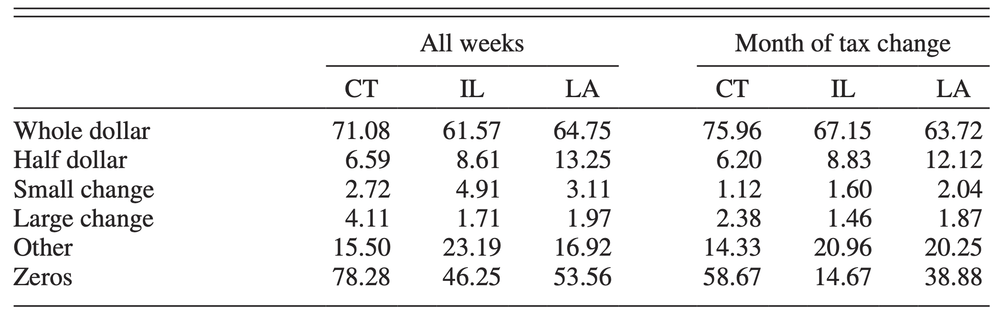
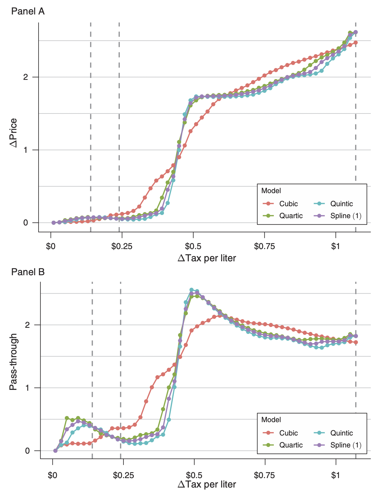
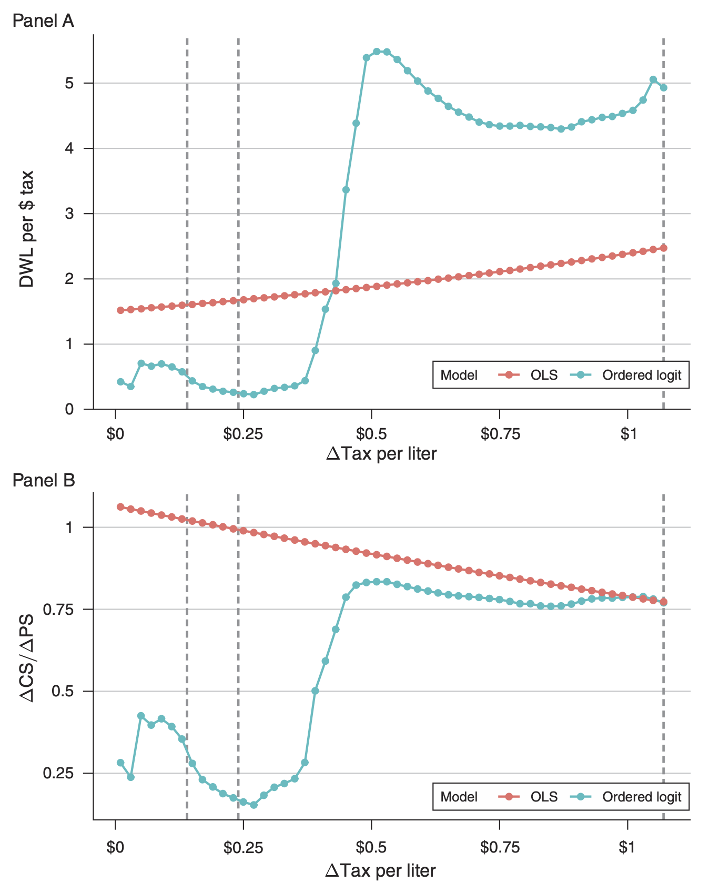

# Introduction

## Abstract

This paper uses UPC-level data to examine the relationship between excise taxes, retail prices, and consumer welfare in the distilled spirits market. [They] document a nominal rigidity in retail prices that arises because firms largely choose prices that end in 99 cents and change prices in whole-dollar increments. [...] Explicitly accounting for price points substantially impacts estimates of tax incidence and excess burden cost of tax revenue. Meaningful nonmonotonicities in these quantities expand the potential considerations in setting excise taxes.

## Motivation

1. Distilled spirits are one of the most heavily taxed commodities in the United Stated (as much as 30-40% of the retail price).
2. The recent availability of high-quality scanner data across a number of retail establishments and unique wholesale price data allow for better measurement of price changes in this product sector than before.
3. In the last decade, many states have been raising alcohol taxes, while at the federal level the Tax Cuts and Jobs Act of 2017 reduced federal excise taxes on alcohol.

**Understanding the welfare implications of existing excise taxes will help inform future reforms.**

## Prior

- There's evidence of over-pass-through, particularly for smaller products that experienced smaller tax increases
- The majority of price changes are made in large, fixed increments such that retailers do not react to taxes by smoothly increasing prices but instead either leave the price unchanged or increase the price sharply, most often by \$1 or \$2
- The nonlinear nature of the price responses to tax increases mean that modestly smaller or larger taxes can lead to sharply different pass-through rates with very different incidence and welfare costs

## Approach

Instead of exploiting discontinuities in the tax schedule as a source of *exogenous* variation to recover frictionless, long-run structural elasticity, they explicitly model the *endogenous* but discontinuous pricing strategies of firms in response to taxes.

### Goal

- ~~Recover the structural relationship between price and taxes that would arise in a frictionless world~~
- Model how pricing rigidities would respond to alternative tax policies
- Understand the welfare implications of tax increases

# The environment

## Twenty-first Amendment

### Control States (18)

The state has a monopoly on either the wholesale distribution or retailing of alcohol beverages (or both).

### License States (52)

These states follow a three-tier system where vertically separated firms engage in the manufacture, wholesale distribution, and retailing of alcohol beverages.

###

Their analysis investigates tax changes in three states:

1. Connecticut
2. Illinois
3. Louisiana

which are license states.

## Changes in Distilled Spirits Taxes in License States, 2007–2016

\centering

## Data

- Kilts Nielsen Scanner dataset — module 5002 (retail sales of spirits products)
  - From 2006 to 2016
  - From both stand-alone liquor stores as well as from supermarkets and convenience stores
  - Weekly scanned data, which track revenues and unit sales at the UPC level for a (nonrandom) sample of stores in all 50 states, 34 states *auf Praxis*
- They aggregate data to the store-product-month level or the store-product-quarter level
- For prices, they use the price from the last full week entirely within that month or quarter

## Regression Weights

They weight all regressions by a product's annual sales in the same store for the calendar year prior to tax change, i.e., they weight products:

- in Connecticut based on 2010 sales
- in Illinois based on 2008 sales
- in Louisiana based on 2015 sales

To address differences in the number of observations for each state, they normalize their weights so that each state receives equal weight in their overall sample.

## Descriptive Evidence

1. There is a regular, seasonal component to price changes with prices increasing in months like January and July, and decreasing in other like February
2. In both Connecticut and Illinois retail prices immediately and sharply increased in the month of the tax hikes, contrary to what happens in Louisiana, where the increase is modest
3. They found evidence of delayed responses with an even larger response in Illinois
4. There is not enough evidence of prices increasing in anticipation of the tax change, even though the laws were passed months prior

## Average Price Change (by Month)

\centering

# Models

## Linear Regression Estimates of Pass-Through

They estimate the pass-through parameter with fixed effects of UPC, as well as month-of-year and year:

$$
\Delta p_{jst} = \rho_{jst} \left( \mathbf{X}, \Delta \tau \right) \cdot \Delta \tau_{jt} + \beta \Delta x_{jst} + \gamma_j + \gamma_t + \epsilon_{jst},
$$

where

- $\Delta p_{jst}$: price changes
- $\Delta \tau_{jst}$: tax changes
- $\Delta$: (1, 3, 6)-month difference
- $\rho(\cdot)$: expected price increase (in dollars) for a \$1 tax increase
- $j$: product
- $s$: store
- $t$: month

## Pass-Through: Taxes to Retail Prices

\centering

## Pass-Through Estimates

\centering

## Quarterly Retail Price Increments

\centering

## A Model of Price Changes with Price Points

Let

$$
\pi_t (\mathbf{p}_t, \mathbf{mc}_t) = \sum_j (p_{jt}, mc_{jt}) q_{jt} (\mathbf{p}) - \phi\cdot \mathbf{1} [p_{jt} \neq p_{j, t - 1}] - \kappa \cdot \mathbf{1} [p_t \notin \mathcal{P}]
$$

They define *price points* in terms of *price changes* so that $\mathcal{P}_t = p_t + \Delta p_t$ where $\Delta p_t \in \left\{ -\$1, +\$0, +\$1, +\$2, +\$3 \right\}$

Finally, the retailer solves a dynamic problem by choosing a sequence of price vectors $\mathbf{p}_t \in \mathbb{R}^J_+$ to maximize

$$
\max_{\mathbf{p}_t \in \mathbb{R}^J_+} \sum_{t = 0}^\infty \beta^t \pi_t (\mathbf{p}_t, \mathbf{mc}_t)
$$

## Estimating Pass-Through with Price Points

To address whole-dollar price changes, they estimate ordered logit models of the form

\begin{equation}
\Delta p_{sjt} = k\ \text{if}\ Y^*_{sjt} \in [\alpha_k, \alpha_{k + 1}],
\end{equation}

\begin{equation}
Y^*_{sjt} = f(\Delta \tau_{jt}, \theta_1) + g(w_{jt}, p_{sjt}, \theta_2) + h(p_{sjt}, p_{-s,jt}, \theta_3) + \beta X_{sjt} + \gamma_t + \varepsilon_{sjt}
\end{equation}

- $f(\cdot)$: tax effect
- $g(\cdot)$: cumulative change in the wholesale price since the last change in the retail price effect
- $h(\cdot)$: competitive pressure

## Specification Comparison for Ordered Logit

\centering

## Welfare Predictions: Ordered Logit versus OLS

\centering

## Welfare Predictions: Alternate Elasticities

\centering

# Conclusions

## Conclusions

With price points there are intervals where the ratio of excess burden per dollar of tax revenue actually declines—revenue increases outpace surplus losses.

They show that theoretically these pricing rigidities can rationalize both incomplete or excessive pass-through without placing restrictions on the demand curve.

As a result of these rigidities, using parameter estimates from a linear regression of change in price on change in tax can be misleading when evaluating alternative tax policies.

Linear regression of price changes on tax changes presumes that price adjustment can happen in a smooth and continuous manner.

## Conclusions

They document that price increases in response to tax changes can be concentrated around certain levels of tax increases.

Further increases beyond these levels may not generate many further price increases but instead come out of firm profits, leading to minimal changes in quantity.

As such, the incidence and social cost of government revenue are tightly linked. 

Taxes are most efficient when the consumer incidence is minimized, and sometimes larger taxes can produce a lower average cost of public funds.

This strongly contrasts with the conventional wisdom that tax efficiency is linearly decreasing in the amount of tax revenue raised.

# How relevant their conclusions are over different time horizons?

<!--
\centering
{width=70%}
-->
